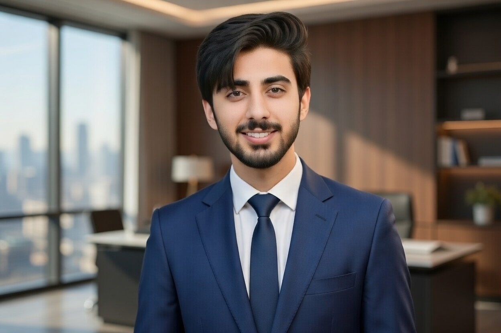

<div align="center">



# 👋 Hi, I'm **Rehan Tabarik**

### ⚡ Electrical Engineering Student | Electronics & Robotics Enthusiast

<a href="https://www.linkedin.com/in/rehan-tabarik-913189384/">

</a>
<a href="https://github.com/Rehan-Tabarik">

</a>

<br>


</div>

---

## 🚀 About Me

🎓 **Bachelor of Electrical Engineering**  
🏫 **Pakistan Institute of Engineering and Applied Sciences (PIEAS)**  
📅 **Batch: 2025–2029**  
📊 **Current GPA: 3.80 / 4.00**

I am an Electrical Engineering student passionate about turning **engineering concepts into practical projects**.

My current interests are focused on:

- 🔌 **PCB Design & Electronics**
- 🤖 **Robotics**
- 💻 **Embedded Systems**
- ⚡ **Electric Vehicles (EVs)**
- 📡 **Signal Processing**
- 🧠 **Engineering & Technology Innovation**

> **"Learn → Build → Test → Improve → Repeat."**

---

## 🧑‍💻 Engineering Journey

```text
Electrical Engineering
        │
        ├── 🔌 Electronics
        │      ├── Circuit Design
        │      ├── PCB Design
        │      └── LTSpice / Multisim
        │
        ├── 🤖 Robotics
        │      ├── Arduino
        │      ├── Servo Control
        │      └── Robotic Systems
        │
        ├── 💻 Embedded Systems
        │      ├── C++
        │      ├── Microcontrollers
        │      └── Hardware + Software
        │
        ├── ⚡ Electric Vehicles
        │      ├── Electronics
        │      ├── Battery Technology
        │      └── EV Systems
        │
        └── 📚 Future Goals
               ├── Advanced PCB Design
               ├── Embedded Systems
               ├── Robotics
               └── Advanced Electronics
